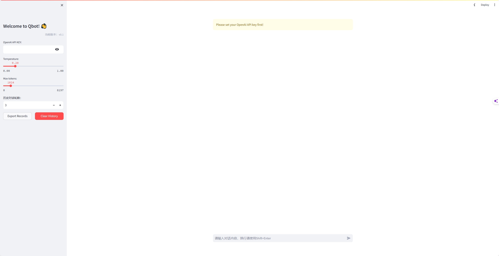
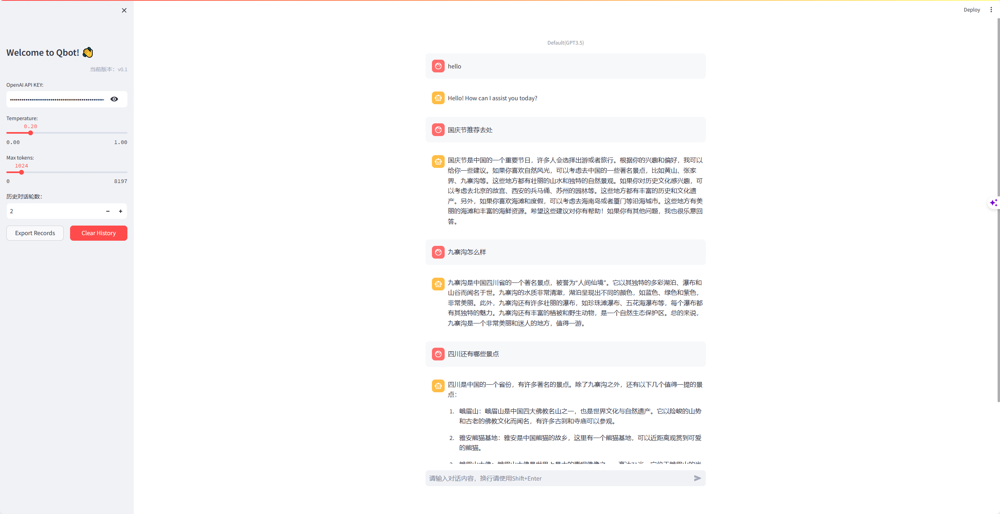

# Qbot 

📃 **Qbot** :  基于 Langchain 与 OpenAI 等大语言模型的本地知识库问答应用实现。
---

## 目录
* [介绍](README.md#介绍)

## 介绍
### v0.1实现功能

1. streamlit基础界面搭建
   - OpenAI API key输入
   - Temperature
   - Max tokens
   - 历史对话轮数
   - 导出历史记录
   - 清空对话框历史信息
2. Streamlit API
   - st.session_state
     - st.session_state.requests
     - st.session_state.responses
   - st.chat_input
   - st.chat_message
   - st.markdown
   - st.container
   - st.caption
   - st.warning
   - st.write
   - st.text_input
   - st.slider
   - st.number_input
   - st.columns
   - st.button
   - st.download_button
   - @st.cache_data
3. Langchain API:
   - ChatOpenAI
   - AIMessage
   - HumanMessage
   - ConversationChain
   - ConversationBufferWindowMemory